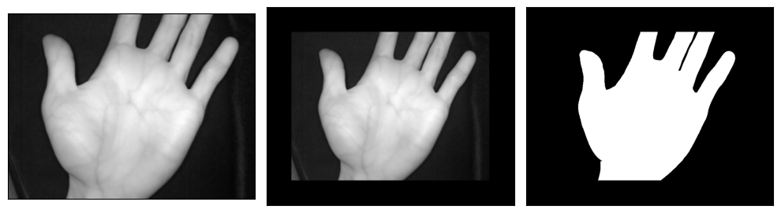
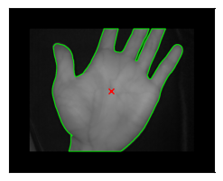
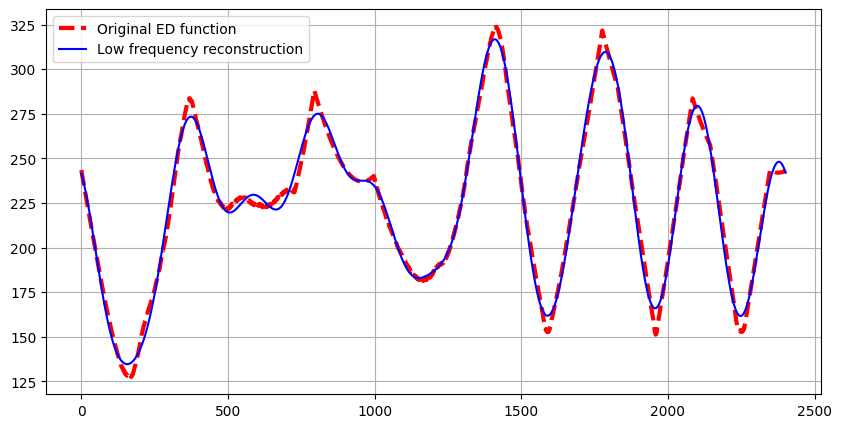
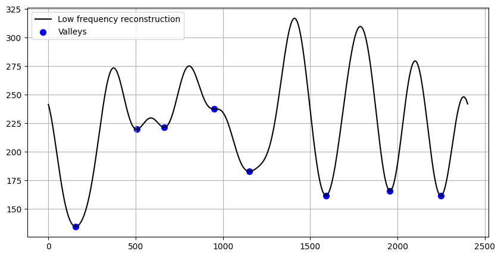
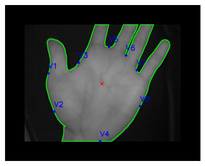
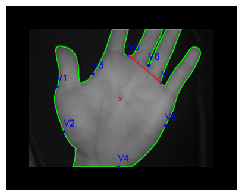
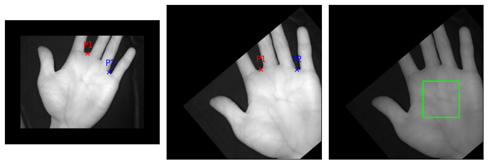
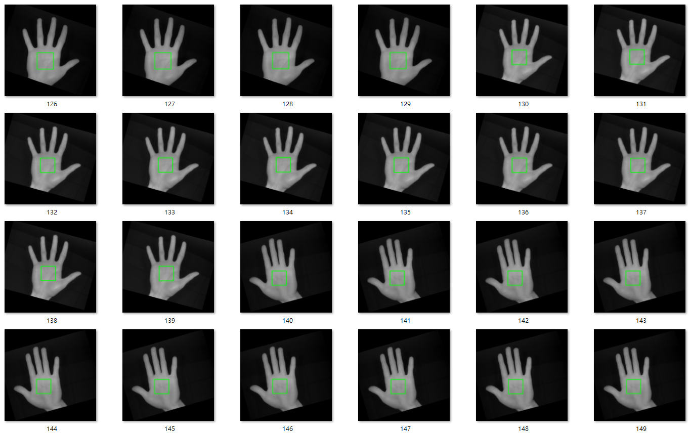

# Palm-ROI-Extraction

## 簡介
程式練習...

用於提取手掌感興趣區域（ROI）的程式。

參考資料如下:

1.IEEE會議論文: [An effectual method for extraction of ROI of palmprints](https://ieeexplore.ieee.org/document/6398207)

2.他人參考會議論文用Python實作: [https://github.com/safwankdb/Effectual-Palm-RoI-Extraction/tree/master](https://github.com/safwankdb/Effectual-Palm-RoI-Extraction/tree/master)

上述提到的參考資料僅能處理左手，經過修改後能夠在小範圍內提取左右手ROI。

---

## 提取ROI步驟

1.圖像轉灰階。

2.將手掌區域與背景分離(二值化加Otsu決定閾值)。

3.使用空間矩的零階矩與一階矩來計算手掌中心x, y座標。

4.將數學形態學侵蝕的kernel由(3, 3)改為十字形，吃出手掌輪廓。

5.算每個輪廓點到中心點的歐幾里德距離。

6.對距離序列進行快速傅立葉變換，截止頻率設15，保留低頻部分，高於截止頻率的分量置零。

7.逆變換。

8.找出降噪後谷點。

9.找出距離最近的三谷點。

10.將三谷點起點終點定義為P1, P2提取感興趣區域。

11.計算P1到P2與水平線的角度，旋轉到水平線後裁剪感興趣區域。

---

## 在自己收集的資料集表現

---

## 使用方法

替換為想測試的圖片後，直接執行 `roi_extraction.ipynb` 

---

## Requirements

python==3.9.2

opencv-python==4.5.3.56

numpy==1.26.4

scipy==1.12.0

matplotlib==3.8.0

